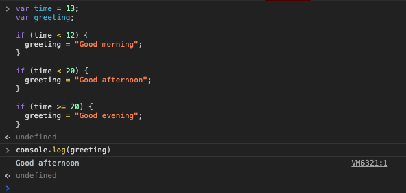
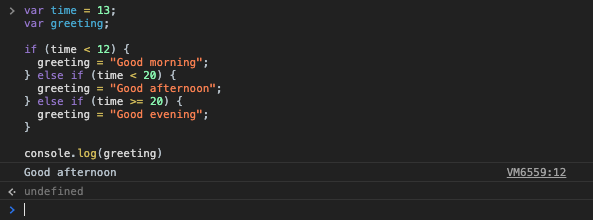

[`Programación con JavaScript`](../../Readme.md) > [`Sesión 02`](../Readme.md) > `Ejemplo 01`

---

## Ejemplo 1: Primeras condicionales

### Objetivo

Implementar operadores lógicos y condicionales tipo `if`/`else`.

#### Requisitos

En una nueva carpeta vamos a crear un archivo `HTML` en blanco llamado `index.html`:

```html
<html>
  <head>
    <script type="text/javascript" src="./ejemplos-sesion-2.js"></script>
  </head>
</html>
```

Dentro de la misma carpeta creamos un archivo `ejemplos-sesion-2.js` que es donde se trabajarán los ejemplos de esta
sesión. Finalmente abre el archivo `index.html` en Chrome e inspecciona la consola para ver los resultados.

#### Desarrollo

Vamos a dar un saludo adecuado dependiendo de la hora.

```javascript
const time = 13;
let greeting;

if (time < 12) {
  greeting = "Good morning";
}

if (time < 20) {
  greeting = "Good afternoon";
}

if (time >= 20) {
  greeting = "Good evening";
}

console.log(greeting) // Good afternoon
```



En lugar de tener distintos bloques con la condicional `if`, podemos concatenarlos todos con `else if`.

```javascript
const time = 13;
let greeting;

if (time < 12) {
  greeting = "Good morning";
} else if (time < 20) {
  greeting = "Good afternoon";
} else if (time >= 20) {
  greeting = "Good evening";
}

console.log(greeting) // Good afternoon
```


